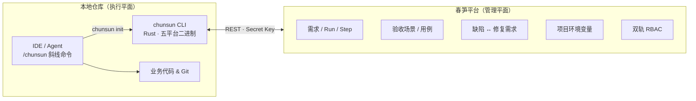

<p align="center">
  
</p>

<h1 align="center">春笋 · ChunSun</h1>
<p align="center">
  
  
  
  
</p>

<p align="center" style="font-size: 18px;">- 竹林细雨落，春笋破土出 -</p>

春笋 · ChunSun 是一个 AI 原生的项目交付平台。它以「需求」为唯一工作对象，平台作为配置与工作流状态的唯一真相源，本地仓库仅负责执行与跑测。不绑定 Agent，通过 `chunsun init` 支持多种主流 Agent 一键接入。在 Agent 中输入 `/chunsun <需求ID>`，Agent 便自主推进实施、上报进度、维护验收场景与用例、更新可跨会话续跑的工作记忆，直到验收全绿交付。

## ✨ 为什么是春笋

- 🎯 自主交付 —— Agent 自主决策工作流，一条命令进入实施 / 询问/ 迭代，跨会话、跨用户、跨 Agent 皆可续跑。

- 🧬 信任 AI —— 避免过度干涉 AI，给 AI 自主决策权。

- 🧠 需求级工作记忆 —— 每个需求自带跨会话留存的大脑（快照 / 决策 / 代码地标），平台为 SSOT、CLI 增量维护。

- 🐛 缺陷闭环 —— 平台支持缺陷管理，`/chunsun-fix` 一键派生修复需求并回链，需求完成即缺陷修复。

- 🔌 Agent 无关 —— 支持多种主流 Agent，`chunsun init` 按所选 Agent 安装 Agent 能力。

- 🔐 团队共享环境变量（Secret-safe） —— 密钥平台登记、加密存储、CLI 实时拉取使用。

- 🛡️ 双轨 RBAC，三档权限矩阵 —— 平台角色 + 项目成员角色双轨认证。

## 🚀 快速开始

> **前置条件**：已有可访问的春笋实例（官方或自建）
>
> **自建**：准备 PostgreSQL → 构建平台二进制 → 运行后打开 `/console/setup` 完成安装向导。配置写入程序同级的 `chunsun.json`。

### 自建部署

```bash
# 1. 准备 PostgreSQL 数据库

# 2. 构建单二进制平台（示例：Linux x64）
pnpm run platform:release -- linux-x64

# 3. 将产物拷到服务器并运行（默认监听 11111）
#    dist/platform/chunsun-linux-x64
#    Windows: dist/platform/chunsun-windows-x64.exe

# 4. 浏览器打开 http://<服务器>:11111/console/setup 完成安装向导
```

- 平台默认端口：**11111**
- 首次访问路径：**`/console/setup`**
- 实例配置：可执行文件同级 **`chunsun.json`**
- CLI 下载包名：`chunsun-cli-{os}-{arch}`（Windows 带 `.exe`），装好后命令仍是 **`chunsun`**
- **部署范围**：请使用独立域名或端口（`https://host:11111/`），**不支持**挂在反向代理子路径（如 `/chunsun/`）

### 1. 安装 CLI

从已部署实例文档页面获取 CLI 安装指令（同一实例的 `/cli/install.sh` 或 `/cli/install.ps1`）。

`chunsun update` 会向当前配置的实例查询版本（`GET /api/v1/health`），并从同一实例下载 CLI，不依赖 `latest.json`。

### 2. 创建项目并获取 Secret Key

进入控制台 → 创建项目 → 项目设置 → 项目密钥 → 获取项目 Secret Key。

### 3. 在本地仓库接入

```bash
# 根目录 .env
CHUNSUN_SECRET_KEY=sk_xxx

chunsun init         # 校验密钥 → 绑定仓库 → 按所选 Agent 安装技能/命令/规则
```

### 4. 发起第一次自主交付

在平台上录入一条需求，然后在 Agent 中运行斜线命令：

```
/chunsun <需求ID>       # 启动 / 继续 / 迭代一条需求
```

Agent 会自动开始实施、上报进度、维护验收场景、用例、更新工作记忆——直到场景全绿。

## 🛠️ 本地开发

```bash
cp .env.example .env   # 填写 DATABASE_URL、JWT_SECRET

pnpm dev               # 网关 :11111 + 官网/控制台 Vite + 后端 :11112（/api 反代）
```

浏览器入口固定 http://127.0.0.1:11111

## 🏗️ 工作原理



平台是配置与工作流状态的**唯一真相源**；本地仓库只负责执行与跑测。

## 🛠️ CLI 命令一览

```txt
chunsun init                  # 一键接入：绑定仓库 + 安装 Agent 能力
chunsun requirement …         # list | create | show | update
chunsun defect …              # list | create | show | update | delete | convert-to-requirement
chunsun run …                 # list | start | takeover | status | remind   （/chunsun 协议）
chunsun step add|list         # 上报/查看执行步骤
chunsun scenario …            # list | upsert | status                     （验收场景）
chunsun case …                # list | upsert | status                     （验收用例）
chunsun context get|put       # 需求工作记忆（Context）
chunsun reset <需求ID>         # 全量重置（重来）
chunsun fix <缺陷ID>           # 派生修复需求并启动自主交付（/chunsun-fix）
chunsun env list|get          # 项目环境变量（实时；本地优先，不同步落盘）
chunsun update                # 向实例查询版本并升级 CLI
chunsun update --check        # 仅对比版本，不下载
```

## 🤝 贡献

本项目以 **MIT License** 开源，源码可自由 fork、修改与自用。

**官方主仓不接受外部 PR 合入。** 若希望反馈问题或讨论方向，欢迎开 Issue；代码层面的共建请基于 fork 自行维护。

官方春笋团队的产品开发走**官方托管实例**（需求 / 缺陷 / 验收在平台推进，本地仓库只执行与跑测）。这与 GitHub PR 流程无关。

如需申请**官方托管实例**的使用权限：创建一个 Issue 发起贡献申请并留下邮箱；审核通过后会开通平台账号并通过邮件通知。

## 📄 许可证

本项目以 **MIT License** 开源，任何人可自由使用、复制、修改、分发（含商业用途）。完整条款见 [LICENSE](./LICENSE)。
