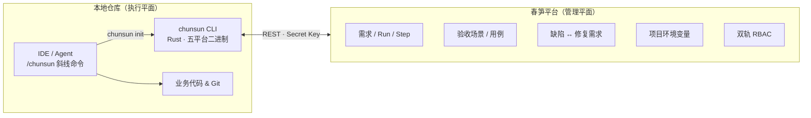

<p align="center">
  <a href="https://chunsun.mengqinghe.com/">
    
  </a>
</p>

<p align="center">
  
</p>

<h1 align="center">春笋 · ChunSun</h1>
<p align="center">
  
  
  
  
  <a href="https://chunsun.mengqinghe.com/"></a>
</p>

<p align="center" style="font-size: 18px;">- 竹林细雨落，春笋破土出 -</p>

**自部署的 AI 原生项目管理平台**——需求、验收、进度留在你的实例上，跨会话、跨用户、跨 Agent 同步续跑。在 Agent 中输入 `/chunsun <需求ID>`，Agent 便自主推进实施、上报进度、维护验收场景与用例，直到验收全绿交付。

## 核心卖点

- **自部署** —— 单二进制平台，PostgreSQL 即可运行；数据与密钥留在你的实例。
- **项目管理** —— 以需求为唯一工作对象，轮次、验收场景、缺陷闭环统一收口。
- **跨时空状态同步** —— 进度、决策、工作记忆在平台留存；换会话、换人、换 Agent 可续跑。
- **多 Agent 支持** —— Cursor、Claude Code 等 8+ IDE，`chunsun init` 一键接入。

> 此外还支持：团队密钥（Secret-safe）、双轨 RBAC、真实依赖验收、缺陷闭环等能力。

## 痛点与方案

| 痛点 | 春笋方案 |
|------|----------|
| **AI 聊完就忘** —— 昨天 Cursor 里推进的需求，今天新开对话要从零解释 | 需求级工作记忆在平台，任意会话 `/chunsun` 续跑 |
| **Issue 看板管不住交付** —— Jira/Linear 记状态，Agent 实际改了什么、验收过没过，对不上 | 验收场景 / 用例 / 轮次步骤都在平台，SSOT 收口 |
| **被单一 Agent 绑定** —— 团队有人用 Cursor、有人用 Claude Code，工具链各搞一套 | `chunsun init` 按 IDE 装技能，同一平台管所有 Agent 的交付 |

## 快速体验

在线 Demo：[https://chunsun.mengqinghe.com/](https://chunsun.mengqinghe.com/)

- 访客可直接浏览官网与控制台界面
- 注册账号后可创建项目、接入 CLI、跑通第一次 `/chunsun`

## 快速开始

> **前置条件**：已有可访问的春笋实例（[在线 Demo](https://chunsun.mengqinghe.com/) 或自建）
>
> **自建**：准备 PostgreSQL → 构建平台二进制 → 运行后打开 `/console/setup` 完成安装向导。配置写入程序同级的 `chunsun.json`。

### 自建部署

```bash
# 1. 准备 PostgreSQL 数据库

# 2. 构建单二进制平台（示例：Linux x64）
pnpm run platform:release -- linux-x64

# 3. 将产物拷到服务器并运行（默认监听 11111）
#    dist/platform/chunsun-linux-x64
#    Windows: dist/platform/chunsun-windows-x64.exe

# 4. 浏览器打开 http://<服务器>:11111/console/setup 完成安装向导
```

- 平台默认端口：**11111**
- 首次访问路径：**`/console/setup`**
- 实例配置：可执行文件同级 **`chunsun.json`**
- CLI 下载包名：`chunsun-cli-{os}-{arch}`（Windows 带 `.exe`），装好后命令仍是 **`chunsun`**
- **部署范围**：请使用独立域名或端口（`https://host:11111/`），**不支持**挂在反向代理子路径（如 `/chunsun/`）

### 1. 安装 CLI

从已部署实例文档页面获取 CLI 安装指令（同一实例的 `/cli/install.sh` 或 `/cli/install.ps1`）。

`chunsun update` 会向当前配置的实例查询版本（`GET /api/v1/health`），并从同一实例下载 CLI，不依赖 `latest.json`。

### 2. 创建项目并获取 Secret Key

进入控制台 → 创建项目 → 项目设置 → 项目密钥 → 获取项目 Secret Key。

### 3. 在本地仓库接入

```bash
# 根目录 .env
CHUNSUN_SECRET_KEY=sk_xxx

chunsun init         # 校验密钥 → 绑定仓库 → 按所选 Agent 安装技能/命令/规则
```

### 4. 发起第一次自主交付

在平台上录入一条需求，然后在 Agent 中运行斜线命令：

```
/chunsun <需求ID>       # 启动 / 继续 / 迭代一条需求
```

Agent 会自动开始实施、上报进度、维护验收场景、用例、更新工作记忆——直到场景全绿。

## 本地开发

```bash
cp .env.example .env   # 填写 DATABASE_URL、JWT_SECRET

pnpm dev               # 网关 :11111 + 官网/控制台 Vite + 后端 :11112（/api 反代）
```

浏览器入口固定 http://127.0.0.1:11111

## 工作原理



平台是配置与工作流状态的**唯一真相源**；本地仓库只负责执行与跑测。

## CLI 命令一览

```txt
chunsun init                  # 一键接入：绑定仓库 + 安装 Agent 能力
chunsun requirement …         # list | create | show | update
chunsun defect …              # list | create | show | update | delete | convert-to-requirement
chunsun run …                 # list | start | takeover | status | remind   （/chunsun 协议）
chunsun step add|list         # 上报/查看执行步骤
chunsun scenario …            # list | upsert | status                     （验收场景）
chunsun case …                # list | upsert | status                     （验收用例）
chunsun requirement memory get|put  # 需求工作记忆（Memory）
chunsun knowledge [--json]      # 项目知识概览（宪法+自定义文档+需求/环境变量统计）
chunsun reset <需求ID>         # 全量重置（重来）
chunsun fix <缺陷ID>           # 派生修复需求并启动自主交付（/chunsun-fix）
chunsun env list|get          # 项目环境变量（实时；本地优先，不同步落盘）
chunsun update                # 向实例查询版本并升级 CLI
chunsun update --check        # 仅对比版本，不下载
```

## 贡献

春笋欢迎社区贡献，采用标准 GitHub Fork & Pull Request 流程。

详细指南（环境准备、分支与提交规范、质量门禁、PR 流程、Bug 报告等）见 [CONTRIBUTING.md](./CONTRIBUTING.md)。

- 重大功能或架构变更，请先开 Issue 讨论
- Bug 报告、功能建议、文档改进，可直接提 Issue 或 PR
- 安全漏洞请勿公开披露，请私下联系维护者

## 许可证

本项目以 **MIT License** 开源，任何人可自由使用、复制、修改、分发（含商业用途）。完整条款见 [LICENSE](./LICENSE).
